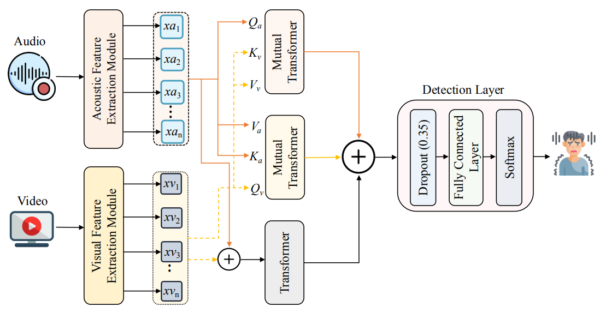

# Multimodal-Depression-Detection

This repository is the official implementation of the following paper.

Paper Title: **[MDD-Net: Multimodal Depression Detection through Mutual Transformer](https://arxiv.org/abs/2508.08093)**
<br/>
[Md Rezwanul Haque](https://scholar.google.com/citations?user=HaI-oFUAAAAJ&hl=en), [Md. Milon Islam](https://scholar.google.com/citations?user=ABC_LOAAAAAJ&hl=en), [S M Taslim Uddin Raju](https://scholar.google.com/citations?user=ToadRS8AAAAJ&hl=en), [Hamdi Altaheri](https://scholar.google.com/citations?user=UkfsK6EAAAAJ&hl=en), [Lobna Nassar](https://scholar.google.com/citations?user=3vcIuocAAAAJ&hl=en), [Fakhri Karray](https://uwaterloo.ca/scholar/karray)
<br/>

#### ***Proceedings of the 2025 IEEE International Conference on Systems, Man, and Cybernetics (SMC), Vienna, Austria. Copyright 2025 by the author(s).***

[](https://arxiv.org/abs/2508.08093)





## Abstract
> Depression is a major mental health condition that severely impacts the emotional and physical well-being of individuals. The simple nature of data collection from social media platforms has attracted significant interest in properly utilizing this information for mental health research. A Multimodal Depression Detection Network (MDD-Net), utilizing acoustic and visual data obtained from social media networks, is proposed in this work where mutual transformers are exploited to efficiently extract and fuse multimodal features for efficient depression detection. The MDD-Net consists of four core modules: an acoustic feature extraction module for retrieving relevant acoustic attributes, a visual feature extraction module for extracting significant high-level patterns, a mutual transformer for computing the correlations among the generated features and fusing these features from multiple modalities, and a detection layer for detecting depression using the fused feature representations. The extensive experiments are performed using the multimodal D-Vlog dataset, and the findings reveal that the developed multimodal depression detection network surpasses the state-of-the-art by up to 17.37% for F1-Score, demonstrating the greater performance of the proposed system. The source code is accessible at https://github.com/rezwanh001/Multimodal-Depression-Detection.

----

**python implementation**

<!-- ```python
Version :   0.0.1  
Author  :   Md Rezwanul Haque
Email   :   mr3haque@uwaterloo.ca 
``` -->
---
### **Related resources**:

**LOCAL ENVIRONMENT**  
```python
OS          :   Ubuntu 24.04.1 LTS       
Memory      :   128.0 GiB
Processor   :   Intel® Xeon® w5-3425 × 24  
Graphics    :   NVIDIA RTX A6000
CPU(s)      :   24
Gnome       :   46.0 
```
---

### 1. Prepare Datasets

We use the [D-Vlog](https://doi.org/10.1609/aaai.v36i11.21483) dataset, proposed in this paper. For the D-Vlog dataset, please fill in the form at the bottom of the [dataset website](https://sites.google.com/view/jeewoo-yoon/dataset), and send a request email to the [author](mailto:yoonjeewoo@gmail.com). 

Following D-Vlog's setup, the dataset is split into train, validation and test sets with a 7:1:2 ratio. 
---

**python requirements**
* **pip requirements**: ```pip install -r requirements.txt``` 

### Execution (Depression Detection)
- ```$ conda activate your_env```

- To train and validate:

    ```$ python mainkfold.py```

- To inference:
    ```$ python infer_mainkfold.py```

### 📖 Citation:
- If you find this project useful for your research, please cite [this paper](https://arxiv.org/abs/2508.08093)

```bibtex
@article{haque2025mdd,
  title={MDD-Net: Multimodal Depression Detection through Mutual Transformer},
  author={Haque, Md Rezwanul and Islam, Md Milon and Raju, SM and Altaheri, Hamdi and Nassar, Lobna and Karray, Fakhri},
  journal={arXiv preprint arXiv:2508.08093},
  year={2025}
}
```

### 🙌🏻 Acknowledgement

- We acknowledge the wonderful work of [GSA-Network](https://openreview.net/forum?id=KiFeuZu24k) and [HAT-Net](https://arxiv.org/abs/2106.03180). 
- The training pipelines are adapted from [depression-detection](https://github.com/AllenYolk/depression-detection).

## License

This project is licensed under the [MIT License](LICENSE).

[](LICENSE)
